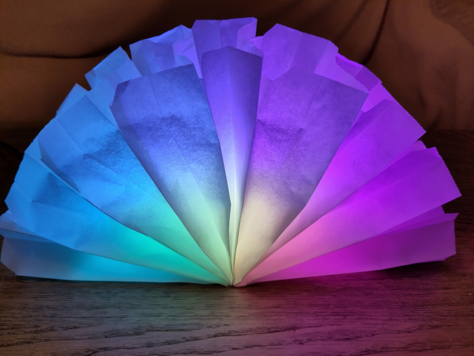

# LED Lamp

This repository contains the code for an LED lamp that I built. It is inspired by the [37C3 Kidspace LEDs project](https://github.com/irgendwienet/37c3-kidspace-leds).
Is it based on an **ESP32c3 mini development board** and uses a **WS2812B LED strip**. A rainbow animation is played 
on the LED strip.

For this implementation I use Rust no_std, since Rust is my favorite programming language.



## Hardware

Here is a list of the hardware that I use:

* ESP32c3 mini development board ([example from UICPAL](https://de.aliexpress.com/item/1005005780121305.html))
* WS2812B LED strip 5V with 30 LEDs/m (I use 18 LEDs)
* 5V power supply
* some short cables
* 9 paper sandwich bags

For detailed instructions on how to build the lamp, please refer to the [37C3 Kidspace LEDs project](https://github.com/irgendwienet/37c3-kidspace-leds). 
Please note that I use a different ESP board and a different GPIO port (see below).

## Toolchain

First you have to install all required tools. You need Rust,
obviously. I use the [rustup](https://rustup.rs/) tool to install and manage Rust. The installation of the toolchain
for the ESP32 is described [here](https://esp-rs.github.io/book/installation/riscv.html). For this example I use the
**no_std toolchain** for the ESP32c6 family. Here the tl;dr version:

```
rustup toolchain install nightly --component rust-src
rustup target add riscv32imc-unknown-none-elf
```
It also makes sense to add some Cargo tools:
```
cargo install cargo-generate
cargo install cargo-espflash
```
## Running the project

To build and run the code on the ESP32 you can use the following command:
```
cargo espflash flash --bin led-lamp --release
```
The code expects the LED strip to be connected to GPIO 0. If you want to use another pin, you can change it in the
`main.rs` file.